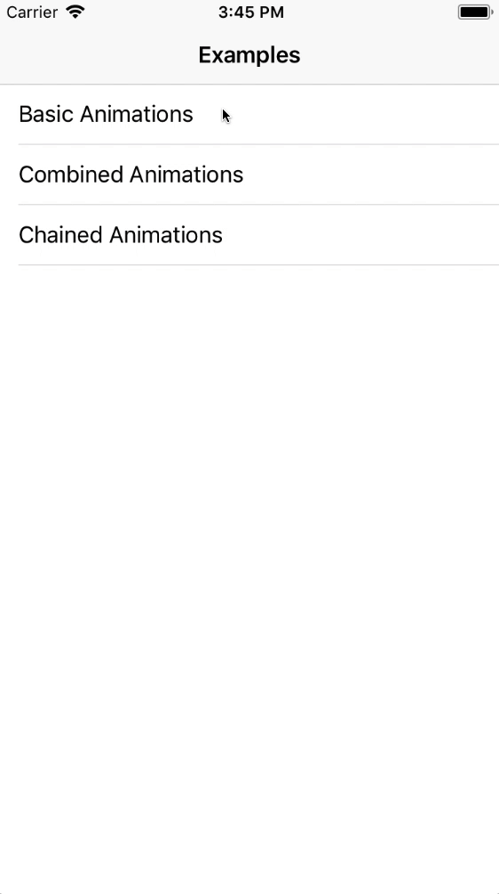

### AnimationBuilder

A simple and easy-to-use wrapper class to deal with iOS animations.

## Overview



## How to use

Instanciate an object from AnimationBuilder, and provide it with the view you want to animate, then use the dot operator to access all it's properties.
To run the animation just use .execute

```Swift
AnimationBuilder(for: passwordTF)
            .translateX(view.frame.width)
            .damping(0.6)
            .duration(1.2)
            .execute(type: .transitional)
```

You have two options to execute the animation:
  * *.transitional* : Shifts the view to the desired location then animate it back to it's original location.
  * *.permanent* : Animate the view to new location permanently.

To run some code after the animation, use the completion block:
```Swift
AnimationBuilder(for: cardView)
            .alpha(1, 0)
            .translateX(view.frame.width)
            .damping(0.8)
            .initialVeclocity(1)
            .options(.curveEaseOut)
            .duration(0.2)
            .execute(type: .permanent, completion: {
                self.dismiss(animated: true)
            })
```
## Installation

Just include  *AnimationBuilder.swift*  in your project.

## Demo

Check out the Example project.

## License

This project is licensed under the MIT License - see the [LICENSE.md](LICENSE) file for details

